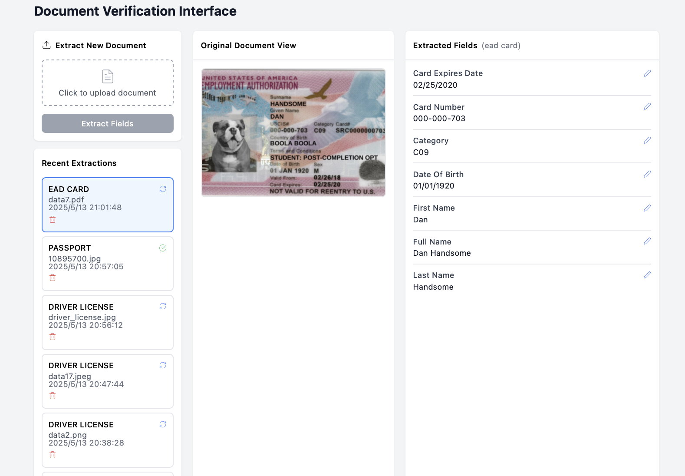

# Document Scanner Project

This is a tool to extract information from documents




## Installation

### Environment

If you prefer conda:

```bash
conda create --name casium_tool python=3.10
```

And for easier handling pdf files, please also install Poppler:

```bash
conda install -c conda-forge poppler
```

or

for macOS users:

```bash
brew install poppler
```

for Linux users:

```bash
sudo apt-get update
sudo apt-get install poppler-utils
```


### Backend

```bash
pip install -r requirements.txt
```

### Frontend

```bash
cd frontend
npm install
```

## Running

```bash
bash start.sh
```

You can run the webpage on http://localhost:3000/  by defalut (You could change that by editing the config file)


## Database

### Initialize new database

```bash
python scripts/init_database.py
```

### Reset database

```bash
python scripts/reset_database.py
```

## Testing

```bash
pip install -r tests/test_requirements.txt
python run_tests.py
```

## Configuration

Edit the `config.py` file in the project root to set:

```python
# OpenAI API Key
OPENAI_API_KEY = 'your_openai_api_key_here'

# Backend server port
BACKEND_PORT = 8000

# Frontend development server port
FRONTEND_PORT = 3000
```

